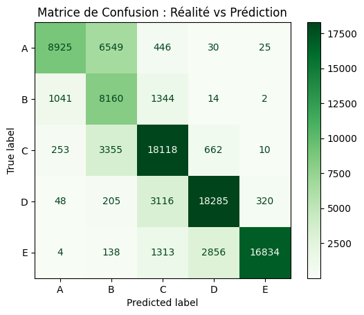
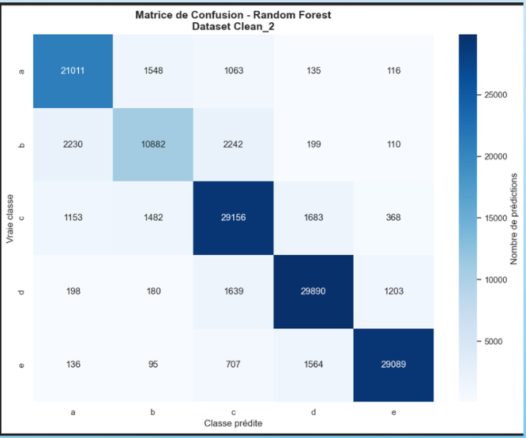

# Comparaison des matrices de confusion

Cette partie compare les performances de nos deux approches : CLassification et Régression

* Le modèle Random Forest Regressor prédit une valeur numérique du Nutri-Score, ensuite convertie en classes A, B, C, D et E.

* Le modèle Random Forest Classifier prédit directement le Nutri-Score Grade.

---

## Résultats observés

Les deux matrices de confusion montrent de bonnes performances globales, car les valeurs les plus importantes se situent sur la diagonale principale. Cela signifie que la majorité des produits sont correctement classés.

Cependant, le modèle de classification présente une diagonale plus marquée, indiquant une meilleure capacité à distinguer les différentes catégories nutritionnelles.

Par exemple :

* Classe **C** :

  * Regressor : `18118` bonnes prédictions
  * Classifier : `29156` bonnes prédictions

* Classe **D** :

  * Regressor : `18285`
  * Classifier : `29890`

* Classe **E** :

  * Regressor : `16834`
  * Classifier : `29089`

Le classifieur obtient donc une meilleure précision globale sur les classes du Nutri-Score.

---

## Analyse des erreurs

Le modèle de régression génère davantage de confusions entre les classes voisines :

* A prédit comme B
* C prédit comme B ou D
* D prédit comme C ou E

Cela s’explique par le fonctionnement même de la régression. Le modèle produit une valeur continue ; une légère erreur autour d’un seuil peut entraîner un changement de classe après conversion.

Exemple :

* une valeur proche de la frontière entre B et C peut facilement être classée dans la mauvaise catégorie.

Les erreurs restent néanmoins cohérentes, car elles concernent principalement des classes nutritionnellement proches.

Le modèle de classification réduit fortement ces confusions, car il apprend directement les frontières entre les catégories A, B, C, D et E.

---

## Conclusion

Le Random Forest Classifier est le modèle le plus performant pour la prédiction du Nutri-Score Grade, car il optimise directement la classification des catégories nutritionnelles.

Le Random Forest Regressor reste cependant intéressant pour modéliser la continuité du score nutritionnel, avec des erreurs généralement limitées aux classes adjacentes.

